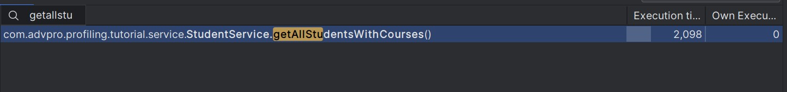

**What is the difference between the approach of performance testing with JMeter and profiling with IntelliJ Profiler in the context of optimizing application performance?**

JMeter : Tool designed for load testing and measuring performance.

Profiling with IntelliJ Profiler: Understanding the behavior of the application at the code level. It allows developers to analyze CPU usage, memory allocation, thread activity, and other aspects.

**How does the profiling process help you in identifying and understanding the weak points in your application?**

Profiling helps in identifying and understanding weak points in an application by providing detailed insights into the application's runtime behavior. It can highlight inefficient code paths, memory leaks, excessive CPU usage, and other issues that might not be apparent during standard testing.

**Do you think IntelliJ Profiler is effective in assisting you to analyze and identify bottlenecks in your application code?**

IntelliJ Profiler is highly effective in analyzing and identifying bottlenecks in application code. It integrates seamlessly with the development environment, providing a convenient and powerful tool for developers to monitor application performance in real-time, analyze heap memory, understand garbage collection activities, and more.

**What are the main challenges you face when conducting performance testing and profiling, and how do you overcome these challenges?**

Since it's my first go at performance testing and profiling, I'm finding it difficult to understand the results from tools like JMeter and IntelliJ Profiler, especially when trying to interpret data from JMeter listeners other than the "View Results in Table"

**What are the main benefits you gain from using IntelliJ Profiler for profiling your application code?**
- Direct integration with the IDE makes it easy to switch between coding and profiling.
- Developers can observe application performance in real-time, making it easier to identify issues.
- Offers detailed visual representations of performance metrics, making it easier to digest complex information.

**How do you handle situations where the results from profiling with IntelliJ Profiler are not entirely consistent with findings from performance testing using JMeter?**

When facing inconsistencies between IntelliJ Profiler results and JMeter findings, I ensure both tests run under similar conditions. 
Then, I Recognize that JMeter  and IntelliJ Profiler measure different aspects—JMeter focuses on load testing, while IntelliJ Profiler examines runtime performance. 
Correlate their findings to identify overlapping issues, adjust test parameters for better alignment, and consider using additional tools for confirmation.

**What strategies do you implement in optimizing application code after analyzing results from performance testing and profiling? How do you ensure the changes you make do not affect the application's functionality?**
To optimize my joinStudentNames method, I used StringBuilder instead of using String and concatenating strings. 
In method getAllStudentsWithCourses I used a single JPQL query with JOIN FETCH to simultaneously retrieve all StudentCourse entities along with their associated student and course information. This method replaces the previous approach of individually querying for each student's courses, streamlining the operation into a single database call.

**JMeter Test**

all-student Request 
- Before

- After

- 
all-student-name Request
- Before 

- After

highest-gpa Request 
- Before

- After

GetAllStudentWithCourse
- Before

- After

JoinStudentName
- Before

- After 

HighestGpa
- Before

- After

- all student

- all student names

- highest gpa

